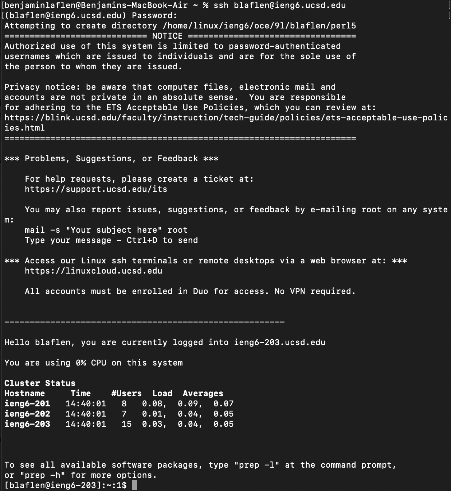

# Lab 1: Remote Access and the Filesystem

### **Introduction**
Hello, today we'll be taking a look at remote filesystems and the secure shell. More importantly, we'll explore how to log into your course account on the CSE computers without physically being there.    
### **Step 1:** Install VSCode
First you'll need to make sure you have Visual Studio Code. This isn't actually necessary, as all operating systems include a command line, but for this lab you'll be using the one embedded in VSCode. You can find it [here](https://code.visualstudio.com/download). Once it's downloaded, pull up the IDE and you should see a window like this:

You can easily open the terminal through *Terminal>New Terminal* in the menu.
### **Step 1.5:** Account
Hopefully you already have your account username and password. If not, you can find your account [here](https://sdacs.ucsd.edu/~icc/index.php) and reset your password [here](https://docs.google.com/document/d/1hs7CyQeh-MdUfM9uv99i8tqfneos6Y8bDU0uhn1wqho/edit). Good luck, because getting a feasible account and password is the hardest part of remotely connecting. 
### **Step 2:** Remotely Connecting
This is surprisingly simple, given how complex web connections between computers usually are to establish. All you need to do is go back to your terminal, type "ssh [ACCOUNT NAME]@ieng6.ucsd.edu", and hit enter. You'll have to enter your password, and then should see a result somewhat like this:

**Good job!** You've connected to a different computer, and are ready to begin running commands on it.
### **Step 3:** Trying Some Commands
The same commands should generally work on your computer and the one you've just connected to. Here's a handy reference guide:
- cd [DIRECTORY]: Moves you into the directory
- cd ~: Returns you to your home directory
- ls: Lists all files in the current directory
- ls [DIRECTORY]: Lists all files in that directory
- cp [FILE DIRECTORY] [TARGET DIRECTORY]: Creates a copy of the file in the target directory
- cat [FILE DIRECTORY]: prints the contents of the file.  

For example,

It's easy to achieve basic functionality on the terminal using commands!
### **Step 4:** Moving files with scp

*No, not that SCP.*

We've shown how to get onto and manipulate other computers with ssh, but that's not particularly useful if we can't bring our files over with us. If you're on the other computer, use "exit" to logout, and find a file you want to send over. All you have to do is just run the command:  

scp [DIRECTORY OF FILE] [SERVER]:[DIRECTORY ON SERVER]  

Let's give an example. If your file is at C:Users/ACCOUNT/Downloads/MyFile.txt and you want to put it on your account on the server ieng6.ucsd.edu at ~/Folder/StoreMyFile/, your command would look like:

scp ~/Downloads/MyFile.txt ACCOUNT@ieng6.ucsd.edu:~/Folder/StoreMyFile/

It seems like a lot at first, but it's intuitive once you're used to command-speak. If you've entered everything correctly, you should see something like:

### **Step 5:** Logging in without a password
###### *Spoiler: that file I just showed moving over has a purpose*  
SSH allows you to ssh and scp into your remote accounts without entering a password every time, using ssh keys. You can easily get a pair of keys by typing "ssh-keygen" in the terminal. You will have to press enter three times to tell the computer to use the default path and not put a password on your password-workaround, but then you should see something like the following, as well as a random picture:

Note down those locations for later. To make the directory for the public key, you need to log into the remote server and type "mkdir .ssh", which will prepare it, and log back out. Then (on your computer) type "[PATH] cs15lfa22@ieng6.ucsd.edu:~/.ssh/authorized_keys" where the path is the one shown earlier asthe location of the public key. If the command runs, you should be able to log in to the server in the future without typing your password.
### **Bonus Step:** Optimizing Remote Running
###### *This assumes you're using MacOS. While there are similar methods available on other Systems, .command is not*
Sometimes you write an application on your computer, but really need to run it on a remote server. Saving, scp-ing, logging in, running, and logging out takes a lot of time. Luckily, there's an "easy" workaround. 

When it comes to executing the same command in a terminal over and over, there's no better tool than a .command file. You can double click one and it will literally execute each line within itself as terminal commands. For our use case, the following file is perfect:

You could easily swap the directory and file name to customize it to your own situation. All that's left is to tell MacOS to let you execute the file.
###### *Apple really doesn't like people making runnable applications*
This can be done by navigating to the directory of the .command file in the terminal, and running chmod +x [FILE NAME]. Afterwards, the file will run every time you double click it. Below is a demonstration:

https://user-images.githubusercontent.com/114254189/193159844-110ac92d-be95-477e-9d2b-63c506130592.mp4

### **Conclusion**
Connecting to a remote server or computer is an extremely valuable skill to learn. By being able to share files and sign in without a password, as well as using commands, the process becomes easy and intutitive.
