# Week 3 Lab Report: Search Engine and Bug Fixes
## **Part 1: Simplest Search Engine**
In week 2, we created a simple search engine to run on a local machine. It had the ability to add, store, and retrieve strings entered by users. My code for this engine is as follows:
~~~java
import java.io.IOException;
import java.net.URI;
import java.util.ArrayList;

public class SearchEngine {
    public static void main(String[] args) throws IOException {
        if(args.length == 0){
            System.out.println("Missing port number! Try any number between 1024 to 49151");
            return;
        }

        int port = Integer.parseInt(args[0]);

        Server.start(port, new Handler());
    }
}

class Handler implements URLHandler {
    ArrayList<String> contents = new ArrayList<String>();
    public String handleRequest(URI url) {
        if (url.getPath().equals("/")) {
            String returner = "All Uploaded Strings";
            for(String s: contents) {
                returner += "\n" + s;
            }
            return returner;
        } else {
            System.out.println("Path: " + url.getPath());
            if (url.getPath().contains("/add")) {
                String[] parameters = url.getQuery().split("&");
                String returner = "Added:";
                for(String s: parameters) {
                    contents.add(s);
                    returner+="\n" + s;
                }
                return returner;
            } else if(url.getPath().contains("/search")) {
                String parameters = url.getQuery();
                System.out.println("yes");
                String returner = "Results for: " + parameters;
                for(String s: contents) {
                    if(s.contains(parameters)) {
                        returner+="\n" + s;
                    }
                    
                }
                return returner;
            }
            return "404 Not Found!";
        }
    }
}
~~~

This site allows one to easily upload new strings and query the strings that are contained. Here is an example upload command and server response:
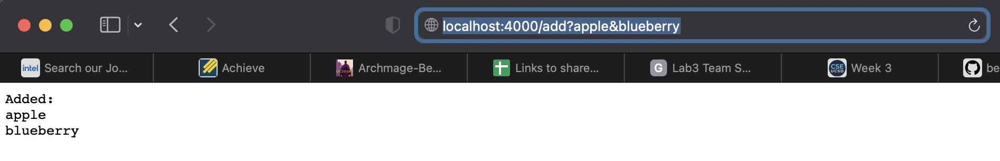

This calls **HandleRequest** method of the Handler, which takes as its argument the path of the entered url, matches the **add** term to its intended behavior, and updates the **contents** ArrayList by adding the terms of the url following the "?". In this case, contents would begin as [], but end as [apple, blueberry].

After adding several strings using this method, the server's homepage is updated to the following:
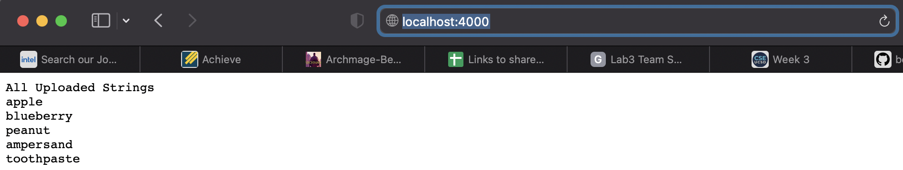When entering the localhost:4000 url without any following arguments, the HandleRequest method is still called with the url as its argument, but recognizes that there are no keywords to act on. Thus, the contents variable stays the same (in this example [apple, blueberry, peanut, ampersand, toothpaste]), and simply displays to the screen.

Finally, the user can easily query the site using the "search" command:
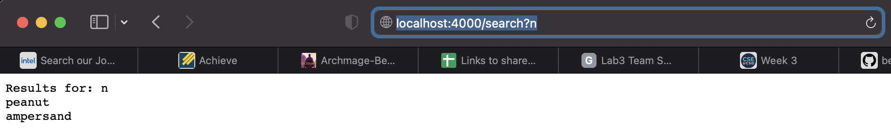
The HandleRequest method is again invoked with the url as its parameter, but this time it identifies the "search" in the url as a keyword, and returns only the strings that contain the following string. **Contents**, however, stays the same, so that future queries can access different strings.

## **Part 2: Bug Fixes**
In week 3, we practiced testing, identifying, and fixing bugs in a variety of list-related programs. 

## List
One bug that was interesting to me was a Heap Overflow error caused by the sample List class. The relevant method was written:
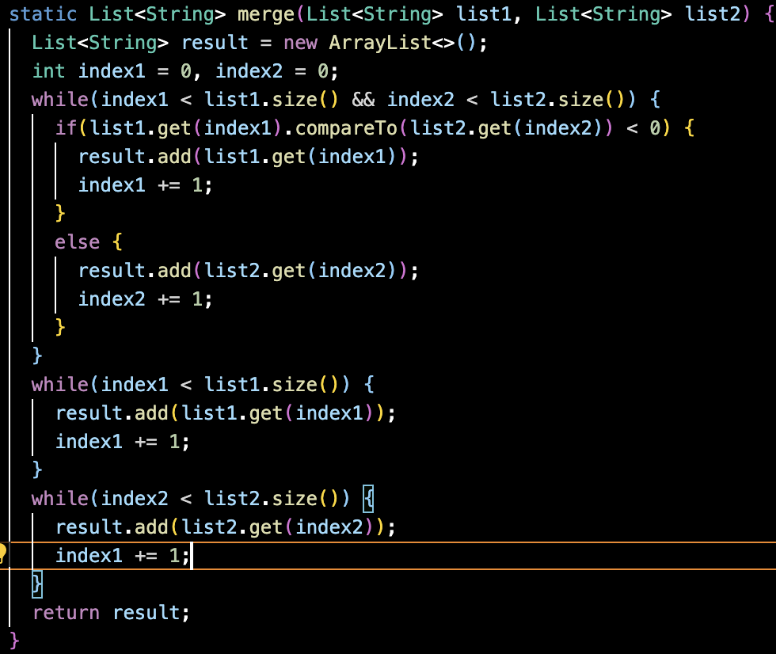
It looks relatively innocuous, and in fact the bug can be traced to a single incorrect character. To test this method, I created the following test:
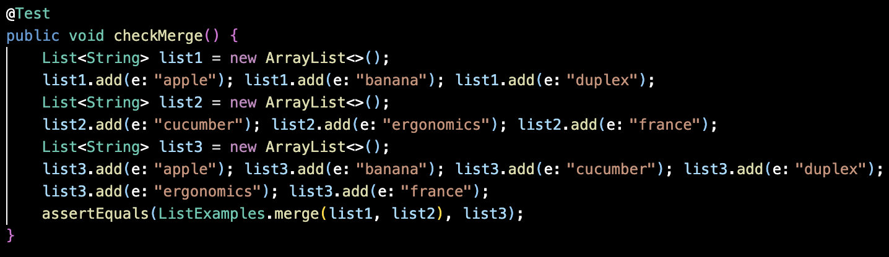
Essentially, this test method created two lists that would then be merged together. Crucially, list2 happened to be the one that would add the final term. However, when running the program, the method took approximately 20 seconds to produce a Heap Overflow Error:
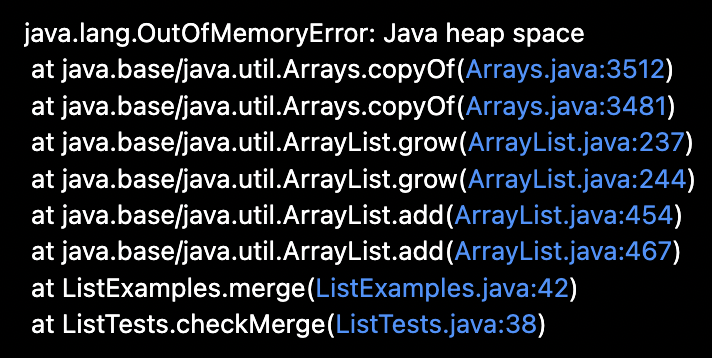
Because I was seeing a Heap Overflow, I knew that some process must have been creating infinite instances (since a program this small wouldn't create enough finite objects to overflow the heap). I eventually traced the bug to a single line:
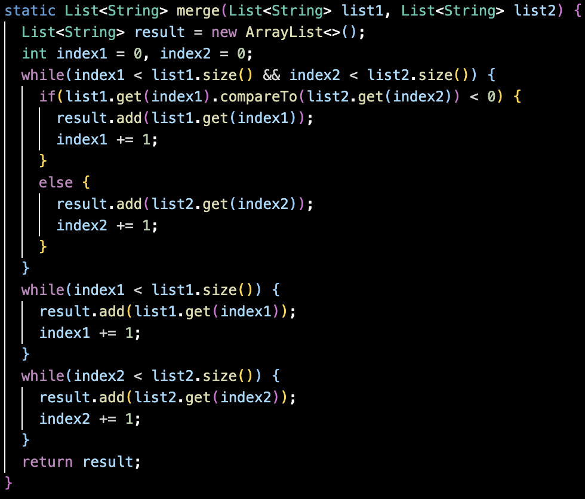
In the third while loop, 3 lines from the bottom, index1 was incrementing by one. The only problem was that the while loop was dependent on index2, *not* index1. By entering this while loop, the program went infinite and, because every iteration it added to a list, overflowed its alloted memory.

Detecting this bug was contingent on the test adding list2's final term last. If list1 was to be the last one added, list2 would have finished in the first while loop, and the program would progress to the second loop isntead of the third.

## LinkedList

The second bug I was most proud of catching took place in the **first()** method of the sample LinkedList class. Originally, this method was simply:
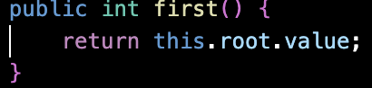
However, I noticed an interesting feature of this implementation that led me to believe this method was flawed. The antithesis of this first() method is the last() method, which returned the final term in the list. But first, last() made sure that there was any term at all, and if not threw an *ElementNotFoundException*. To test my theory that first() was missing a crucial exception check, I wrote a test method:
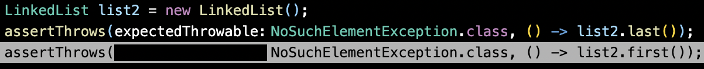
By instantiating an empty list and calling both first() and last() with the same expected output, I could check whether they were bugged to not behave the same. Sure enough, last() produced the expected exception, while first() produced the following:
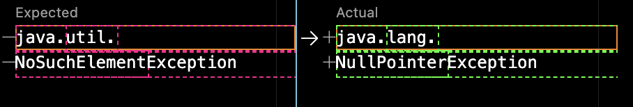
Because it wasn't told to check if there was a missing element, the program just saw that it was trying to retrieve a null value and broke. With this in hand, I added a clause to first() to cover this case using the same methodology as last().
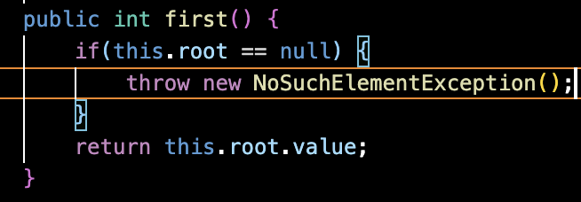