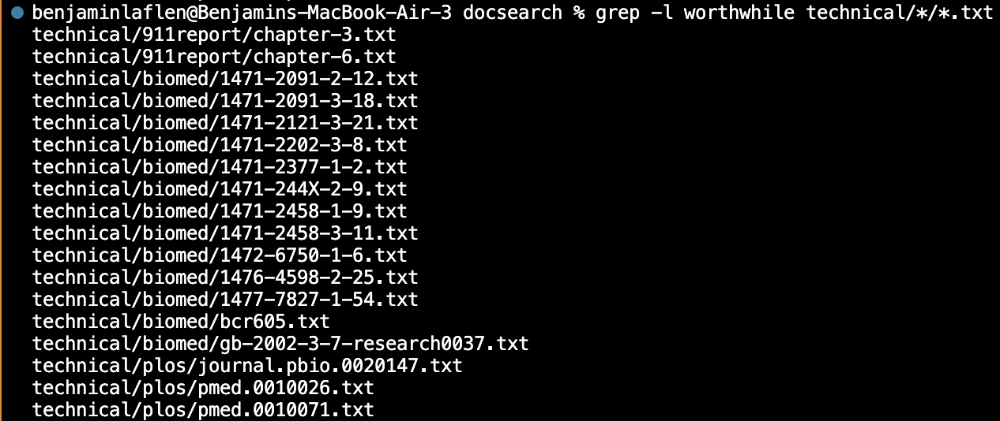

# Week 5 Lab Report: Grep Options
## **Introduction**
Grep is a useful terminal command for exploring the content of files you have. By entering grep \<file> \<String>, you can search a file (or all files that match a pattern with \*) for a given phrase or string. Grep will return a list of all the lines that contain that phrase. However, grep has several options that can be toggled on to change and expand its functionality.

## **-l: List files**
By entering -l between grep and \<file>, you can instruct grep to output the names of files instead of lines.

This still works with generic paths using \*, allowing you to identify which directories contain the phrase most often.

Here, 911report contained only 2 instances of "worthwhile", while plos had 3 and biomed contained a whopping 13. However, this becomes even more valuable when paired with multiple directory trees, using -r or just entering them.

Without -l, I would have no idea where these assorted lines are coming from, but with it I can see all the individual files.

## **-r: Recursivity**
Unfortunately, this most recent use of -l is somewhat outclassed by -r, which given the same sort of command as -l is an improvement, as it includes the lines with the files containing them.

However, this isn't the real use for -r, which allows you to recursively search complicated file trees by opening and scanning directories. This makes commands intended to search large systems much simpler.

This allows you to see into folders with varying depths (while still hitting the text or other files on the way). For example, if I wanted to know how much government documents talk about opposing *parties*, I could enter:

-r makes a whole lot of uses of grep a lot more straighforward.
## **-L: Exclusion**
-L operates very differently to the other two options. When -L has been specified in a grep command, it will not return any files that contain the phrase. In fact, it will return every file that doesn't contain the phrase.

Earlier we saw that Chapters 3 and 6 of this story were the only ones to contain "worthwhile", and now we see they are indeed the only ones missing. This can be extremely useful when a word is contained more often than not. For example, if I wanted to know which selfish documents never mention "ours", I could just enter

and have a complete list. The primary concern when using -L is how common a word really is. For example, "worthwhile" is a pretty uncommon word. If I put it in a broad -L command, I get a lot of results.

When to use -l and when to use -L is a delicate balance. Of course, if one fills your screen you know to just run the reciprocal.

## **Conclusion**
Grep is an already immensely useful terminal command with many powerful options. Carefully selecting and using these functions makes rapid data gathering and filtering much easier than without them.