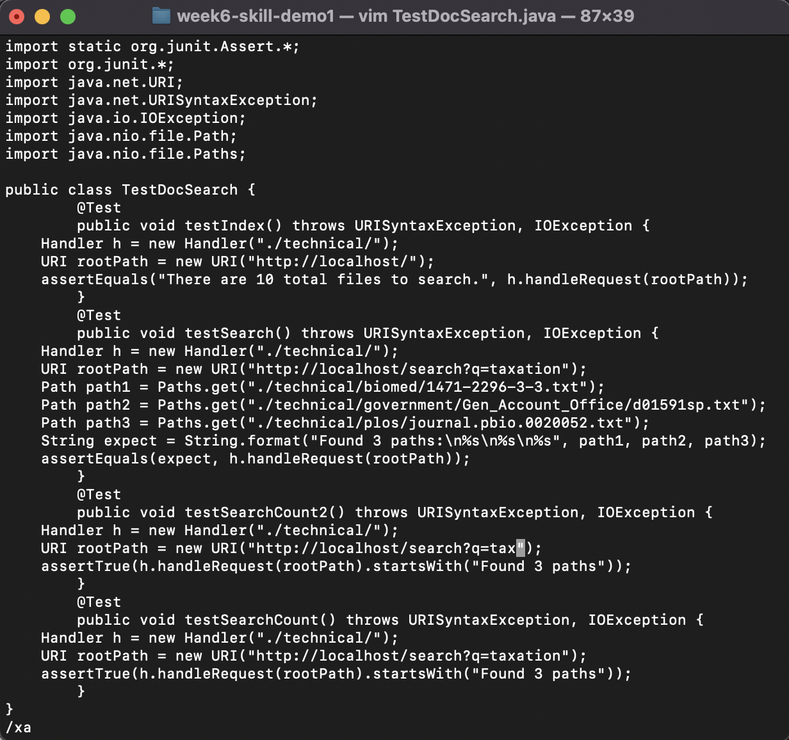

# Week 7 Lab Report: Vim
## **Part 1**
Our first task is to simplify a task to the fewest keystrokes possible using vim. The task my group chose was the "challenge" task of creating a new test and changing a parameter in TestDocSearch.java in under 30 keystrokes. 

###### Note: For these purposes, I assume I start tracking strokes as soon as vim is entered, and end as soon as vim is exited. I also will not be counting the modifier keys (Shift, Control, Command, Alt, etc.) as keystrokes because keyboard drivers handle them differently than keystrokes, and even when you listen to keystrokes on stdin in C you can't get the modifier keys.

#
I got the problem down to a miniscule 27 keystrokes, out of which almost all are just moving around. The initial file appears as such:

We then execute our first 6 keystrokes:
- 25j
- V
- 5j

The first command brings us to the beginning of the method we're copying, V enters Visual Line mode, and 5j selects the entire method. This results in the following:

We now spend another 7 keystrokes to get the new method in place and reposition the cursor:
- y
- k
- p
- j
- 27l

y yanks the selected code (essentially copying it). We then reposition the cursor and paste with p, before returning to the proper line where we need to make our first change.

Now we execute another 7 keystrokes:
- i2
- \<esc>
- /xa
- \<enter>

 i2 enters Insert Mode and adds a 2 to our method name, which we then need to exit with escape. /xa searches the document for "xa", which there is conventiently only one instance of. Enter takes us to this location.

To change "taxation" to "tax", we only need 3 keystrokes:

- l
- dw

l moves forward one character, positioning us perfectly for dw, which deletes the rest of the word.

All that's left is 4 keystrokes:
- \<esc>
- :wq

which leaves search mode and then saves and quits. In total, this sums to 27 keystrokes, beating our 30 keystroke limit. This also looks like:
###### 25jV5jykpj27li2\<esc>/xa\<enter>ldw\<esc>:wq
which looks more like AES-256 than editing instructions, but it works.

## **Part 2**

In this part, we were supposed to compare how quickly we're able to execute and run the change from part 1 on a remote machine using VS Code or using Vim. For both, I set up commands as much as possible (on vim I used my Part 1 script and for VS Code set up all the commands I'd need) My VS Code run took 24 seconds from start to the end of the bash script. 
###### Although I realized afterwards that I SCP-ed the wrong directory. Regardless, the time would have been the same since I prepped the command beforehand.
My vim run was actually going pretty well until 0:20 when \<esc> failed to take me out of search mode (most likely shell difference). It's anyone's guess whether it would have been faster even so. This highlights the reason I would generally rather use a text editor like VS Code than work remotely: I can always make a shell script to automate the repetitive commands, but version differences on the remote computer could be highly prohibitive. Now, if the files I was working with were large enough that they would take extremely long times to scp, there's no faster way to get them onto the server, and the changes are fairly routine, I'd definitely consider vim. But I've been trained with a mouse, and it's probably not efficient overall to switch that.

##### *VS Code*

##### *Vim*