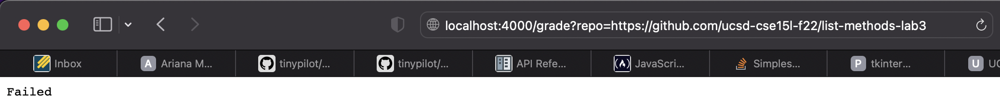
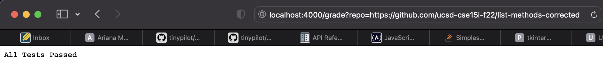
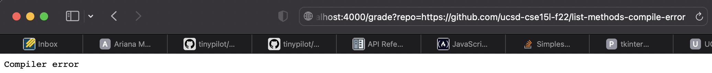
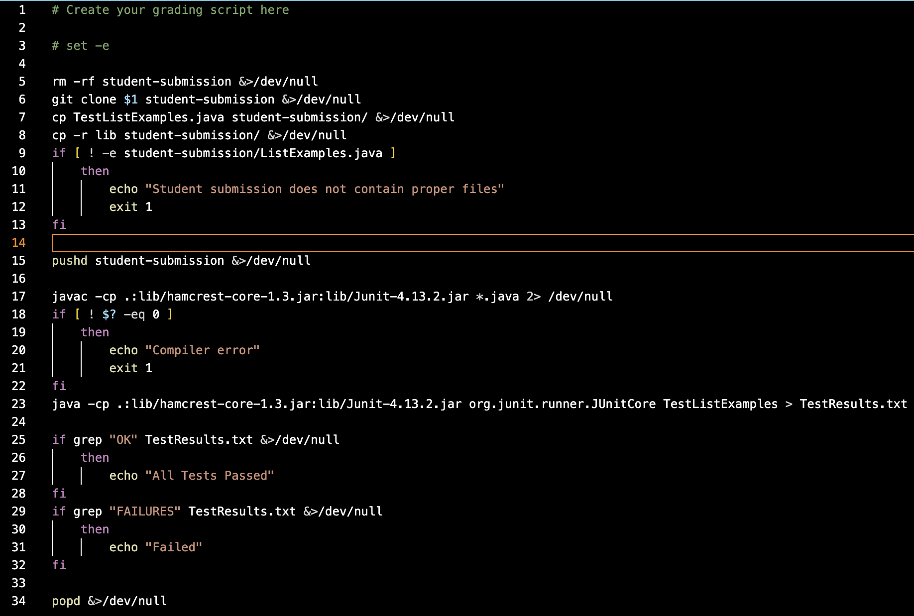

# Week 9 Lab Report: Grading and Scripts
## **Introduction**
For most programming classes, it is important for teachers to be able to grade their students work. An easy way to do this is to pull a student's repository and run a series of tests on it. To gain insight into how this works, this week we created our own autograders to test various student submissions, and integrated two modes: the grader could be run either from a server, or from the command line.
## **Sample output**
The results for 3 sample submissions as seen in the browser are shown below. 

##### *Failing some tests*

##### *Succeeding on all tests*

##### *Compiler Error*

While this is a fairly brutal grading scheme, I have seen actual assignment schemes that are not far off.

## **Process**
This autograder site is built on top of a bash script that automates JUnit tests, as seen below:

Let's walk through what this script does when given our first input above (by line):

5\. The first four lines are header. Then line 5 clears the directory we'll be using, enabling it to then be refilled. (all output sent to the void, EC 0)

6\. We clone the given student repository into the newly freed directory. (all output sent to the void, EC 0)

7\. Copy the JUnit tests we'll be running into the repository folder. (all output sent to the void, EC 0)

8\. Copy JUnit itself into the folder. (all output sent to the void, EC 0)

9\. Check whether the student submission actually contains the files it's supposed to. (stdout and stderr sent to default places, EC 1)

10-12. Are in an if statement that does not run.

15\. Save the current directory for later and move into the repository. (all output sent to the void, EC 0)

17\. Compile the student submission and testing program. (all output sent to the void, EC 0)

18\. Check whether there was a compiler error. (stdout and stderr sent to default places, EC 0)

23\. Run the testing script. (stdout redirected to TestResults.txt, stderr normal, EC 0)

25\. Check whether the output file contains "OK" because if it does all tests have passed. (all output sent to the void, EC 1)

26-27. Are in an if statement that does not run.

29\. Check whether the output file contains "FAILURES" becuase if it does at least one test failed. (all output sent to the void, EC 0)

31\. Print the result. (stdout and stderr sent to default places, EC 0)

34\. Return to the previous saved directory. (all output sent to the void, EC 0)